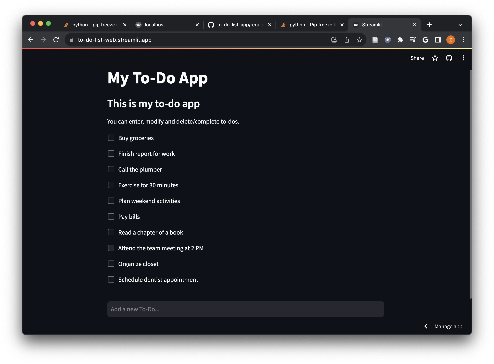

# To Do List App

* Implemented a To-Do List application, which allows user to enter, modify and delete/complete to-dos.
* Created Front-Ends that supports Command Line, Desktop GUI, Web Application.

**Skills**: Python, PySimpleGUI, Platypus, streamlit

## Command Line Interface (CLI)

- `cli.py`: Command line interface. 
- `function.py`:  Simple back-end implementation using python. 

## Macbook Desktop Graphic User Interface (GUI)

- `gui.py`: Window layout and button choices created by `PySimpleGUI 4.60.5`. We have used interactive elements of Button, Listbox, Labels, and Pop-up windows.
- `function.py`:  Simple back-end implementation using python. 
- `My To Do List.app/`: an mac desktop stand-alone application processed by `Platypus`


## Web App

- `web.py`: Deploy the app with web-based front-end user interface using `streamlit 1.29.0`
- Used interactive elements, such as textbox and checkbox. 
- Hosted the website at [to-do-list-web.streamlit.app/](https://to-do-list-web.streamlit.app/). 

- 

## Tools

* Python 3.11.5
* PySimpleGUI 4.60.5
  * Useful link: [Cookbook - PySimpleGUI](https://www.pysimplegui.org/en/latest/cookbook/)
  * [Cheet Sheet 1](./images/cheat_sheet1.jpg)
  * [Cheet Sheet 2](./images/cheat_sheet2.jpg)
  * [Cheet Sheet 3](./images/cheat_sheet3.jpg)
* Platypus
  
* streamlit 1.29.0
  ```
  streamlit run ./web.py 
  ```
* To get only necessary requirements.txt
  ```
  pip install pipreqs
  pipreqs . --force
  ```
